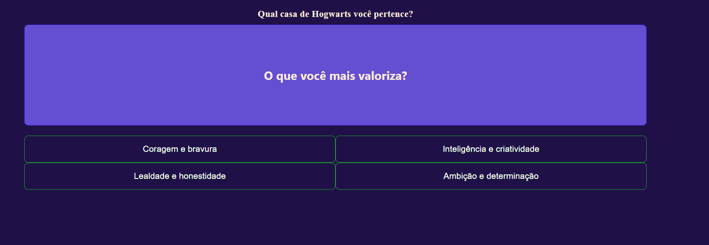
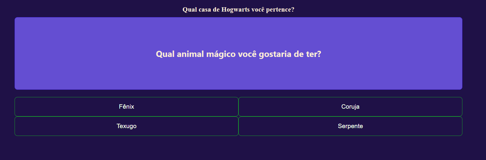
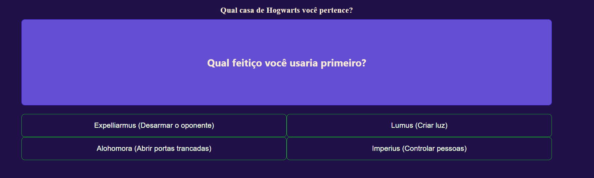
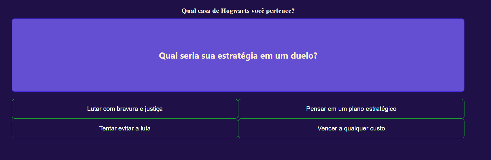
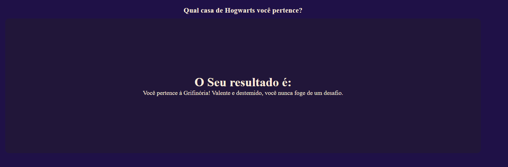

# 🧙‍♂️ Quiz: Qual casa de Hogwarts você pertence?

Este é um projeto desenvolvido em **Angular**, inspirado no estilo de quizzes do Buzzfeed. Ele permite que os usuários respondam a uma série de perguntas baseadas em suas preferências e características, determinando ao final a qual casa de **Hogwarts** eles pertencem: **Grifinória, Corvinal, Lufa-Lufa ou Sonserina**.

## Tecnologias utilizadas
- **Angular** – Framework para desenvolvimento do frontend.
- **TypeScript** – Linguagem principal utilizada no Angular.
- **JSON** – Armazena as perguntas e respostas do quiz.
- **CSS** – Para estilização do layout.

## Como funciona?
1. O usuário responde a uma sequência de **5 perguntas**, escolhendo a opção que mais combina com ele.
2. Cada resposta possui um **alias** correspondente a uma casa de Hogwarts.
3. Ao final, o sistema analisa as respostas e exibe o **resultado** com base na maioria das escolhas do usuário.

## Exemplo de resultado: Grifinória

### 1️⃣ Tela inicial do quiz
O usuário inicia o quiz e vê o título e um botão para começar:

Escolha: **Coragem e bravura**

### 2️⃣ Perguntas do quiz
O usuário responde às perguntas, escolhendo a opção que mais o representa:

Escolha: **Fênix**

Escolha: **Expelliarmus (Desarmar o oponente)**

Escolha: **Lutar com bravura e justiça**

Escolha: **Usaria sem medo para testar seus poderes**

### 3️⃣ Resultado do quiz
Após responder todas as perguntas, o sistema exibe a casa correspondente:

**"Você pertence à Grifinória! Valente e destemido, você nunca foge de um desafio."**

## Conclusão
Este projeto foi desenvolvido durante o **bootcamp Decola Tech 2025**, oferecido pela **DIO** em parceria com a **Avanade**. Ele serviu como uma excelente oportunidade para praticar **Angular**, **TypeScript** e conceitos fundamentais de desenvolvimento web.

