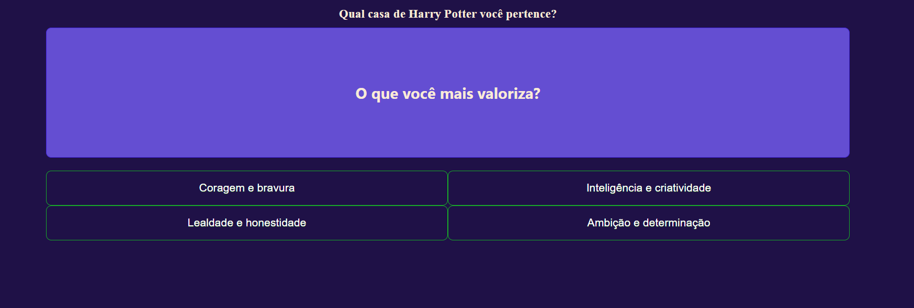

# 🧙‍♂️ Quiz: Qual casa de Hogwarts você pertence?

Este é um projeto desenvolvido em **Angular**, inspirado no estilo de quizzes do Buzzfeed. Ele permite que os usuários respondam a uma série de perguntas baseadas em suas preferências e características, determinando ao final a qual casa de **Hogwarts** eles pertencem: **Grifinória, Corvinal, Lufa-Lufa ou Sonserina**.

## 🏗️ Tecnologias utilizadas
- **Angular** – Framework para desenvolvimento do frontend.
- **TypeScript** – Linguagem principal utilizada no Angular.
- **JSON** – Armazena as perguntas e respostas do quiz.
- **CSS** – Para estilização do layout.

## 🎮 Como funciona?
1. O usuário responde a uma sequência de **5 perguntas**, escolhendo a opção que mais combina com ele.
2. Cada resposta possui um **alias** correspondente a uma casa de Hogwarts.
3. Ao final, o sistema analisa as respostas e exibe o **resultado** com base na maioria das escolhas do usuário.
